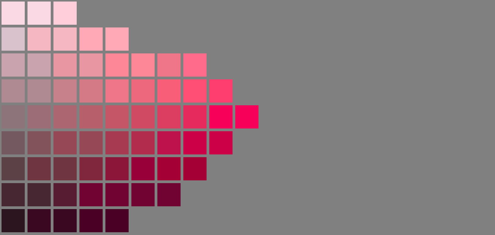

# Virtual 3-D Munsell Color Tree		
The objective of this project is to exend this work done by Andrew Worth: 	

<a href="http://www.andrewwerth.com/color/"><br/>Virtual Munsell Color Wheel<br/> by Andrew Werth © 2023<br/>All rights reserved.</a>

To a 3-D virtual app that approximates The Pantone Munsell Color Tree:

<a href="https://www.amazon.com/X-Rite-M70115-Munsell-Color-Tree/dp/B007E9JERU/ref=asc_df_B007E9JERU/?tag=hyprod-20&linkCode=df0&hvadid=167144081759&hvpos=&hvnetw=g&hvrand=13670204540587953849&hvpone=&hvptwo=&hvqmt=&hvdev=c&hvdvcmdl=&hvlocint=&hvlocphy=9029705&hvtargid=pla-309540220012&psc=1"><br/>A Pantone Munsell Color Tree for sale at Amazon.com</a>


<a href="https://www.gettyimages.com/detail/news-photo/an-old-fashioned-rolodex-7-june-2005-smh-picture-by-quentin-news-photo/539713049"><br/>An old-fashioned rolodex</a>

Picture replacing each index card of this old-fashioned rolodex with a transparent index card with a matrix of ColorChips. And then placing it on its side, so its axis is vertical.  

## Andrew Worth's color wheel  

Regarding the top-most image, click on the image to open Andrew Worth's site. Then click on different any Hue in the circular color wheel to see the its Hue Page. Notice how each Hue Page has a different shape but they are common in that the left-most column has diminished Chroma (or saturation) and Chroma increases towards the right-most column. The bottom-most row has the lowest Value and the highest rows have the highest Values.

## The Munsel Color System

The Munsell Color system, is based on rigorous measurements of human subjects' visual responses to color, putting it on a firm experimental scientific basis. Because of this basis in human visual perception, Munsell's system has outlasted its contemporary color models, is still in wide use today.  (see Wikipedia/Munsell_color_system)

## The 3-D Color Space

Munsell's Color Conversion List describes the mapping between the RGB Color Space and the Munsell Color Space of Hue, Value and Chroma. It was created using experimental human observations. There is no simple linear equation for associating Munsell Color Keys with RGB color values. These associations require table lookups.  


## The Pantone Munsell Color Tree

The Munsell Color Space has been materialized as a set of Hue Pages all oriented perpendicular to a horizontal base, all connected to a vertical shaft at the center of the flat base. Each page of this Tree is rotated some number of degrees about the vertical axis of the shaft. The color Red is typically set to be 0 degress. Then going clockwise, the next Color or HuePrefix, Yellow, is set at 72 degrees. The other Hue Pages have increasing degree headings up to Red-Purple, which has a setting of 324 degrees.  The next hue then comes back to Red at 360 or 0 degrees.

One implementation of <a href="https://munsell.com/color-blog/color-tree/#:~:text=The%20trunk%20of%20the%20tree,goes%20from%20light%20to%20dark.">the Munsell Color Tree</a> (currently available for purchase at <a href="https://www.amazon.com/s?k=munsell+color+tree&crid=3KCB09105J62H&sprefix=munsell+color+tree%2Caps%2C153&ref=nb_sb_noss_1">Amazon.com for $424</a>) uses five primary Hues and five intermediate Hues making ten `color branches`. The Munsell-to-RGB-Tables spreadsheet splits the color space into 10 primary HuePrefixes each with 4 intermediate Hues.

## Munsell-to-RGB tables

As mentioned above there is no simple linear equation for associating Munsell Color Keys with RGB color values. These associations require table lookups. 

This repo contains the `Munsell-to-RGB-Tables` in an Excel spreadsheet with macros enabled. When opening this file in Excel be sure not to ignore the macros. The macros are critical to the functionality of some of the sheets. 

The sheets of this spreadsheet are as follows:  

* Intro - gives credit to the creators of this spreadsheet.
* Setup - describes 10 basic Colors or HuePrefixes each with their 4 intermediate Hues.
* HuePages - describes how HuePrefix and intermediate Hues define each HuePage and how each HuePage has a page number, degrees, and a png image file name.
* Conversion Lists - describes the mapping between Munsell Keys and RGB Color values. ColorChips have Values that range vertically from 1 to 9 and Chroma values that vary horizontally
* Grey lists - shows the 11 grey values defined along the vertical shaft mentioned above, ranging from 0 as black at the bottom to 10 as white at the top.
* Value-Chroma - is a macro-driven page that shows Values and Chroma for a given HuePage defined by its HuePrefix and Hue using the dropdowns at the top left. 
* HuePrefix-Chroma - is a macro-driven page that shows the 10 HuePrefix pages for a selected Value and Hue using the dropdowns at the top left.
* Hue-Chroma - this macro-driven page shows Hue and Chroma for a selected HuePrefix and Value using the dropdowns at the top left.

## Macro-driven Sheets
Note that macro-driven sheets are oriented differently in the Munsell Color Tree. Value is oriented vertically along the y-axis with black at the bottom and white at the top. Chroma is shown horizontally on each page on the x-axis with zero chroma as gray on the left and maximum chroma on the right.

Note that the Hue dropdown on the Value-Chroma page currently not working for choices 5.0 and 10.0.

## Munsell vs RGB color gamut
Note that the shape of the Value and Chroma combinations on the HuePrefix/Hue pages do not fill the entire page. This illustrates the non-linear nature of the HVC mapping to RGB. The color gamut of the Munsell Color space does not match the color gamut of the RGB color space.

## Muncell Dimensions
Munsell Tree partitioning is:  
* 10 Colors or HuePrefixes  
* 4 intermediate Hue-Pages per HuePrefix = 40 Hue-Pages
* 9 Value-Rows per Hue-Page  
* ~8 Chroma-Columns per Value-Row \(approx average\)  
with a total of 2,734 Color Chips 

## The Munsell Color Chips  
Munsell Color Tree models are available at many retail outlets, including Amazon.com. These models use Pantone paint chips, which explains the hight cost.

Each Color Chip in the `Conversion Lists` sheet has a unique RGB Color Value and its Munsell Color Key. The Munsell Color Key encoding format is:    
```
    (<Hue><HuePrefix>)-<Value>-<Chroma>
```

For example, Munsell Key `10.0RP-3-12` decodes to   
* HuePrefix = `RP`   
* Hue = `10.0`  
* Value = `3`  
* Chroma = `12`  

So, in 3-D Munsell space this chip has location  
HuePage=`10.0RP` (or Page#=`40`), Row=`3`, Column=`12`. 

This example Munsell Color Key is at row `2689`, column `F` in the `Conversion List` table. The corrsponding RGB Color Value next to it at column `G` is `149,0,69`.

## Implementation

Matthew Davis uses Vanilla javascript (not three.js) to create this magnificent orthographic viewer of a random collection of RGB color cubes.


  <span>See the  <a href="https://codepen.io/gametroll/pen/jOQyYZN">full screen 3D color selector Pen</a>
   on <a href="https://codepen.io">CodePen</a>.

For this project, we need to extend the model by replacing the 3D color cubes with flat ColorChips arranged as shown in each HuePage.

### HuePages and ColorChips

This repo contains the `Munsell-to-RGB-Tables.xlsm` folder, which contains 40 png files, one for each HuePage. For example, this is `351-10.0RP.png`


Each filename has format:  
```
<degrees>-<Hue><HuePrefix>.png
```
so `351-10.0RP.png` decodes to  
`degrees`=351, `Hue`=10.0, `HuePrefix`=RP  



## The 3D model and the GreyShaft 

The 3D model for the Virtual 3-D Munsell Color Tree	is the set of HuePages, each projected on a plane oriented perpendicular to the horizon. All HuePages connect to a vertical "GreyShaft" at the center.

The vertical GreyShaft should have a diameter that matches the ColorChip width in the HuePages. It should have 11 rows of equal length that match the row height and spacing of the ColorChips. Each row on the GreyShaft should be given grey values that rane from 0 (#000) to white (#fff) as shown in the "Grey lists" page of the spreadsheet.

HuePages are placed within a gap distance to the Grey Shaft on their zero-chroma side. HuePages have vertical values that only range from 1 to 9, so HuePage rows should align with the 1 thru 9 rows of the GreyShaft.

Each HuePage is rotated some number of degrees about the vertical axis of the GrayShaft. The color Red is typically set to be 0 degress. Then going clockwise, the next Color or HuePrefix, Yellow, is set at 72 degrees. The other Hue Pages have increasing degree headings up to Red-Purple, which has a setting of 324 degrees. The next hue then comes back to Red at 360 or 0 degrees.

Each HuePage in the HuePages folder has the degrees defined as the filename's 3-digit prefix. Each image file should be projected onto a plane that has bee rotated that number of degrees about the vertical center GreyShaft.

When loading these PNG image files, make the grey background color transparent and crop each image at top and bottom to remove the title text. Retain the ColorChip boundaries. The horizontal width of each image can be trimmed to fit the existing ColorChips, but HuePage edges should not be visible.

## 3D model orientation and position
1. The vertical axis of the model always aligns with that of the viewport and viewer
2. The tree should be floating at a reasonable fixed distance from the ground plane
3. Viewer can rotate the tree about its vertical axis using click and drag on any of its pages 

Removed  
~~4. Viewer can tilt the tree torwards or away with another slider widget~~  
~~5. Viewer can zoom in or zoom out from the tree within reasonable limits with another slider widget~~

## Lighting
1. The tree should cast a blurred shadow on the ground plane
2. Subtle lighting from above, behind, left of viewer

## HuePage mode
1. Viewer can click on a HuePage to view it in HuePage mode, where the HuePage replaces the view of the tree
2. When viewing just the HuePage, on ColorCell hover, Munsell Key value and RGB values  are displayed at the right side of the hz slider widgets 
3. On ColorCell click, the scene background is changed to match its RGB value


